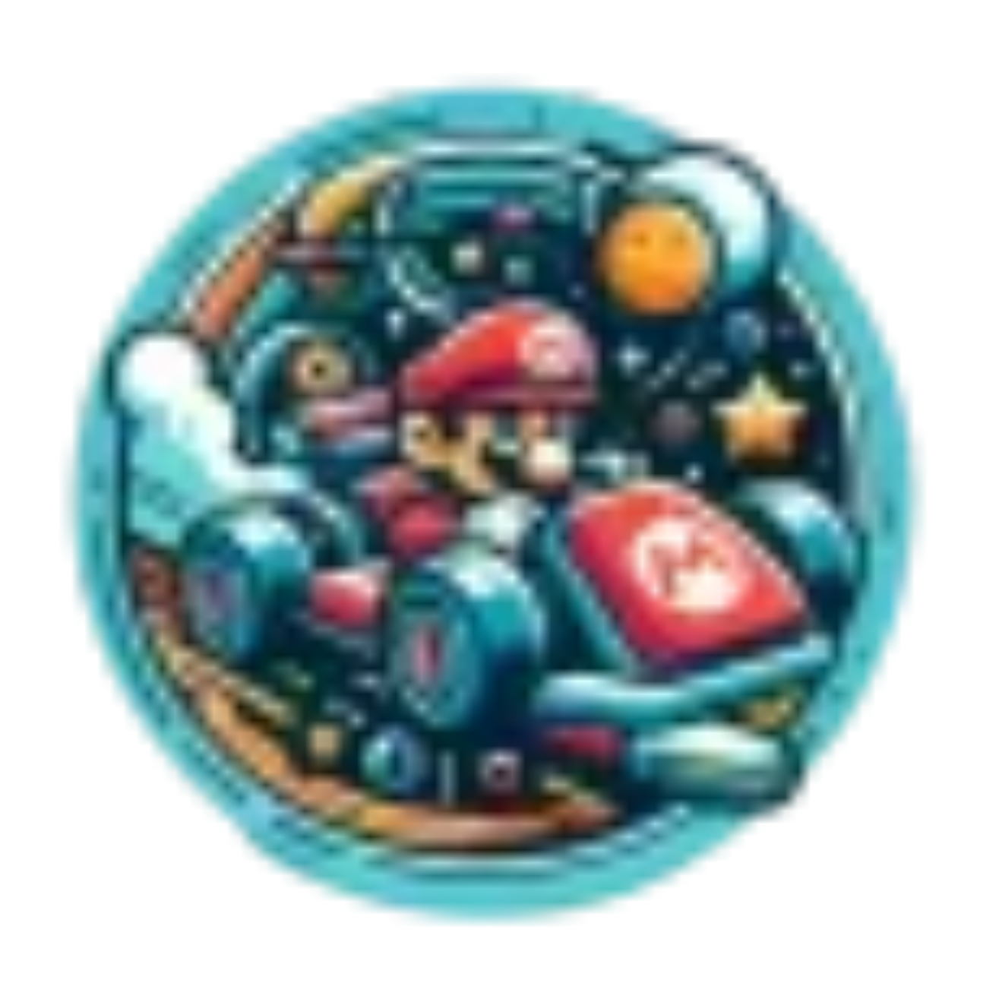
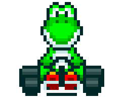
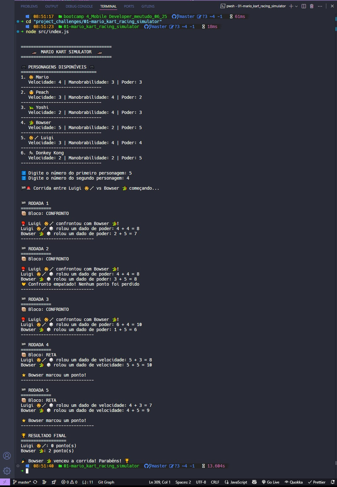

  <p align="center">
    
  </p>

# Mario Kart Racing Simulator

<p>  </p>

Taught by _Felipe Silva Aguiar_ - Tech Educator at DIO.

---

## 🎯 Objective

This project simulates the logic of a Mario Kart racing game, a popular series developed by Nintendo. The goal is to implement a console-based game where two characters compete on a random track over 5 rounds, following specific rules and mechanics to determine the winner based on points. ✅

---

## 🏎️ Characters and Attributes

The game features six playable characters, each with unique attributes: **Speed**, **Maneuverability**, and **Power**. These attributes influence the outcome of different track segments.

<h2></h2>
      <table style="border-collapse: collapse; width: 800px; margin: 0 auto;">
        <tr>
            <td style="border: 1px solid black; text-align: center;">
                <p>Mario</p>
                
            </td>
            <td style="border: 1px solid black; text-align: center;">
                <p>Speed: 4</p>
<p>Maneuverability: 3</p>
<p>Power: 3</p>
            </td>
             <td style="border: 1px solid black; text-align: center;">
                <p>Peach</p>
                
            </td>
            <td style="border: 1px solid black; text-align: center;">
                <p>Speed: 3</p>
<p>Maneuverability: 4</p>
<p>Power: 2</p>
            </td>
              <td style="border: 1px solid black; text-align: center;">
                <p>Yoshi</p>
                
            </td>
            <td style="border: 1px solid black; text-align: center;">
                <p>Speed: 2</p>
<p>Maneuverability: 4</p>
<p>Power: 3</p>
            </td>
        </tr>
        <tr>
            <td style="border: 1px solid black; text-align: center;">
                <p>Bowser</p>
                
            </td>
            <td style="border: 1px solid black; text-align: center;">
               <p>Speed: 5</p>
<p>Maneuverability: 2</p>
<p>Power: 5</p>
            </td>
            <td style="border: 1px solid black; text-align: center;">
                <p>Luigi</p>
                
            </td>
            <td style="border: 1px solid black; text-align: center;">
                <p>Speed: 3</p>
<p>Maneuverability: 4</p>
<p>Power: 4</p>
            </td>
            <td style="border: 1px solid black; text-align: center;">
                <p>Donkey Kong</p>
                
            </td>
            <td style="border: 1px solid black; text-align: center;">
                <p>Speed: 2</p>
<p>Maneuverability: 2</p>
<p>Power: 5</p>
            </td>
        </tr>
    </table>

<p></p>

---

## 🕹️ Rules and mechanics:

> ### Players:
>
> ✔️&nbsp;&nbsp; The user can select any two characters to compete in the race from the available roster.

> ### Tracks
>
> ✔️&nbsp;&nbsp; Characters will race on a random track for 5 rounds.
> ✔️&nbsp;&nbsp; In each round, a track block will be drawn, which can be a straight, curve, or confrontation:
>
> - [x] If the track block is a **STRAIGHT**, the player must roll a 6-sided die and add the **SPEED** attribute, whoever wins gets a point.
> - [x] If the track block is a **CURVE**, the player must roll a 6-sided die and add the **MANEUVERABILITY** attribute, whoever wins gets a point.
> - [x] If the track block is a **CONFRONTATION**, the player must roll a 6-sided die and add the **POWER** attribute, whoever loses, loses a point.
> - [x] No player can have a negative score (values below 0).

> ### Victory condition:
>
> ✔️&nbsp;&nbsp; In the end, whoever has accumulated the most points wins.</label>

---

## 🧩 Features

- [x] &nbsp;&nbsp; **6 Playable Characters:** Mario, Peach, Yoshi, Bowser, Luigi, and Donkey Kong.
- [x] &nbsp;&nbsp; **Interactive Selection:** Choose which characters compete in each race.
- [x] &nbsp;&nbsp; **Three Track Types:** Straight (tests Speed), Curve (tests Maneuverability), Confrontation (tests Power).
- [x] &nbsp;&nbsp; **Dice-Based Mechanics:** 6-sided dice rolls combined with character attributes.
- [x] &nbsp;&nbsp; **Visual Feedback:** Colorful console output with emojis and clear results.
- [x] &nbsp;&nbsp; **Point System:** Comprehensive scoring with no negative values

---

  <p align="center">
    
  </p>

---

### 🛠️ Technologies Used

The project was fully completed and some of the resources used were:

[](https://developer.mozilla.org/en-US/docs/Web/JavaScript)

[](https://nodejs.org/)

[](https://code.visualstudio.com/)

---

### ⚙️ Setup and Running

- [x] &nbsp;&nbsp;&nbsp; Prerequisites:

✔️ - Node.js (version 18.11.0 or higher).
✔️ - No additional dependencies are required.

- [x] &nbsp;&nbsp;&nbsp; Clone the repository:

```bash
git clone https://github.com/ed-radanovis/Bootcamp-Mobile-Developer_Project-Challenges_06-2025/tree/master/project_challenges/mario_kart_racing_simulator
```

- [x] &nbsp;&nbsp;&nbsp; Navigate to the project directory:

```bash
cd mario_kart_racing_simulator
```

- [x] &nbsp;&nbsp;&nbsp;Run the game:

```bash
node src/index.js
```

> 📝 Note: The game will prompt you to select two characters and then automatically execute the race simulation in your terminal with colorful console output showing each round's results! 🎮

---

## 📂 Project Structure

- `src/`: Contains the main JavaScript files for the game logic.
- `assets/`: Stores images and GIFs used in the README and game.
- `index.js`: Entry point for running the game.

---

## 🧠 Skills Learned

##### 🏁 &nbsp;Upon completing this project, you will have developed:

- Game logic implementation using JavaScript.
- Object-oriented programming concepts.
- Random number generation and probability simulation.
- Conditional logic for game mechanics.
- Score tracking and game state management.
- User input handling and validation.
- Interactive console applications.

---

## 🚀 How to Play

- 1 &nbsp; ➡ &nbsp; Select two characters from the available roster.
- 2 &nbsp; ➡ &nbsp; The game will simulate 5 rounds of racing.
- 3 &nbsp; ➡ &nbsp; Each round, a random track segment is selected.
- 4 &nbsp; ➡ &nbsp; Based on the segment type, different attributes will be tested.
- 5 &nbsp; ➡ &nbsp; Points are awarded or deducted based on performance.
- 6 &nbsp; ➡ &nbsp; After 5 rounds, the player with the highest score wins!

---

## 🤝 Contribute

Contributions are welcome! Feel free to open issues or submit pull requests to enhance the project.

## 📜 License

This project is licensed under the [MIT License](LICENSE).

<br>

[⬆ Back to top](#mario-kart-racing-simulator)
