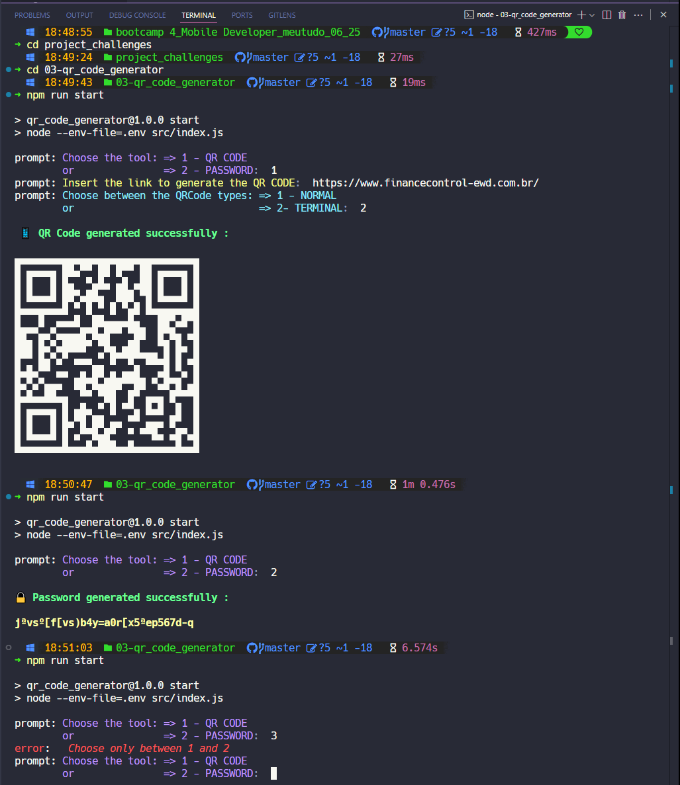

<p align="center">
    
  </p>

# QR Code and Password Generator

### 🔍 Overview

A scalable backend application designed as a utility kit for e-commerce, developed to practice Node.js and JavaScript concepts. This project focuses on generating QR codes and secure passwords, with a modular structure to allow the addition of new features.

Taught by _Felipe Silva Aguiar_ - Tech Educator at DIO.
<br>

> ### 🎯 Objective:
>
> - This project was created to practice backend development skills using **_[Node.js](https://nodejs.org)_** and pure **_[JavaScript](https://developer.mozilla.org/en-US/docs/Web/JavaScript)_**. It implements a QR code generator (normal or terminal format) and a password generator with configurable character sets, reinforcing concepts like asynchronous programming, modularization, environment variable usage, and layered project architecture. The design prioritizes scalability to support future feature additions. ✅

<br>

### 🧩 Features

- Generate QR codes from a provided URL (normal or terminal format)
- Generate secure passwords with configurable character sets (uppercase, lowercase, numbers, special characters)
- Interactive command-line interface with colored prompts using **_[Chalk](https://www.npmjs.com/package/chalk)_**
- Input validation for user selections
- Environment variable configuration for password generation

---

  <p align="center">
    
  </p>

---

### 📚 Prerequisites

- [ ] &nbsp;&nbsp;&nbsp;Before starting this project, you should have basic knowledge in the following areas:
      <br>

- **Programming Logic:** Understanding of basic programming concepts.
- **JavaScript (Basic):** Familiarity with JavaScript syntax and asynchronous programming.
- **Node.js (Basic):** Basic understanding of Node.js runtime and its module system.
- **Node Modules:** Knowledge of how to work with Node.js modules.
- **NPM, Packages, Dependencies:** Experience with installing and managing dependencies via NPM.
- **Environment Variables (.env):** Understanding of how to use environment variables for configuration.

---

### 🛠️ Technologies Used

The project was fully completed and some of the resources used were:

[](https://developer.mozilla.org/en-US/docs/Web/JavaScript)

[](https://nodejs.org/)

[](https://www.npmjs.com/)&nbsp;&nbsp;&nbsp;[](https://www.npmjs.com/package/chalk)&nbsp;&nbsp;&nbsp;[](https://www.npmjs.com/package/prompt)&nbsp;&nbsp;&nbsp;[](https://www.npmjs.com/package/qrcode-terminal)

[](https://code.visualstudio.com/)

---

### 📂 Project Structure

```bash
project_challenges/03-qr_code_generator/
├── assets
├── node_modules
├── src/
│   ├── prompts-schema/
│   │   ├── prompt-schema-main.js      # Main menu prompt configuration
│   │   └── prompt-schema-qrcode.js    # QR code prompt configuration
│   ├── services/
│   │   ├── password/
│   │   │   ├── utils/
│   │   │   │   └── permitted-characters.js  # Password character set configuration
│   │   │   ├── create.js             # Password generation logic
│   │   │   └── handle.js             # Password generation handler
│   │   └── qr-code/
│   │       ├── create.js             # QR code generation logic
│   │       └── handle.js             # QR code generation handler
│   └── index.js                      # Main script to run the application
├── .env                              # Environment variables for password configuration
├── .gitignore
├── package-lock.json
└── package.json
```

---

### ⚙️ Setup and Running

- [x] &nbsp;&nbsp;&nbsp;Node.js (version 18.11.0 or higher).
- [x] &nbsp;&nbsp;&nbsp;Install dependencies listed in package.json.
- [x] &nbsp;&nbsp;&nbsp;Create a .env file in the project root with the following variables for password generation:

```bash
UPPERCASE_LETTERS=true
LOWERCASE_LETTERS=true
NUMBERS=true
SPECIAL_CHARACTERS=true
PASSWORD_LENGTH=12

or configure with your mode
```

<br>
- [ ] If you choose, clone the repository:

```bash
git clone https://github.com/ed-radanovis/Bootcamp-Mobile-Developer_Project-Challenges_06-2025/tree/master/project_challenges/03-qr_code_generator
```

<br>

- [x] Navigate to the project: `cd project_challenges/03-qr_code_generator`.
- [x] Install dependencies: `npm init -y` , `npm i prompt` , `npm i chalk` , `npm i qrcode-terminal`
- [x] Run the Application:

```bash
npm run start
```

<br>

> 📝 Note: The project uses ES Modules so after initializing npm configure package.json including "type": "module" for modern JavaScript import/export syntax. The npm start command automatically loads the .env file using --env-file=.env. which must also be configured in "scripts" in this file.

---

### 🔬 Testing

✔️ - Manual Testing:

- [x] &nbsp;&nbsp;&nbsp;Verify QR code generation for valid URLs in both normal and terminal formats.
- [x] &nbsp;&nbsp;&nbsp;Check password generation with different .env configurations (e.g., enabling/disabling character sets).
- [x] &nbsp;&nbsp;&nbsp;Test input validation for menu selections (1 or 2) and QR code type selection.
- [x] &nbsp;&nbsp;&nbsp; Test edge cases (e.g., invalid URLs, empty .env variables, or invalid input patterns).

---

### 🧠 Skills Learned

✔️ Upon completion of this project, the following skills and subskills will be acquired:

- How to create QR Codes in different formats using the qrcode-terminal package.
- Understanding how to manipulate and integrate various Node.js packages (chalk, prompt, qrcode-terminal).
- Creating projects with a modular structure, separating concerns into prompts, services, and utilities.
- Configuring application behavior using .env files.
- Asynchronous programming with async/await to handle user input and generate output.

---

### 🤝 Contribute

Contributions are welcome! Feel free to open issues or submit pull requests to enhance the project.

---

### 📜 License

This project is licensed under the [MIT License](LICENSE).

<br>

[⬆ Back to top](#qr-code-and-password-generator)
