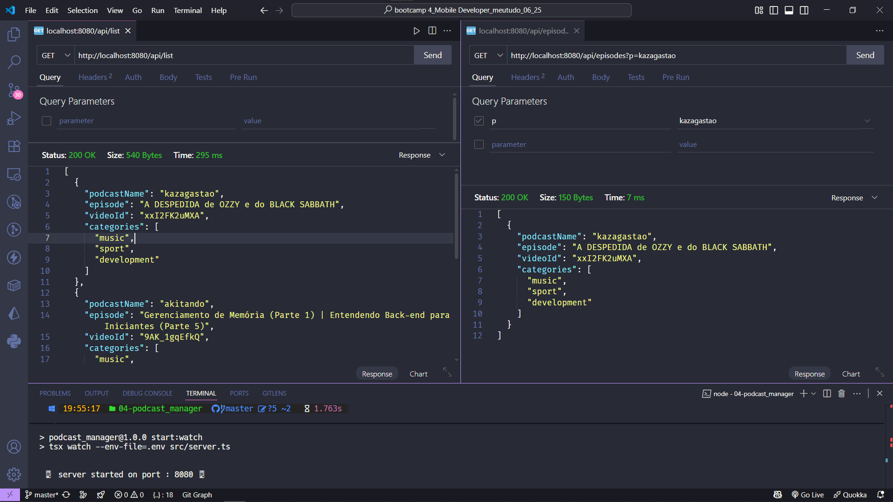
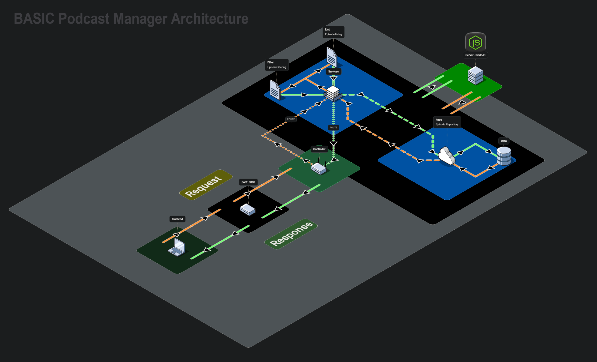

<h1 align="center">🎙️</h1>
<div style="text-align: center;">

# Podcast Manager

</div>

<br>

## 📝 Description

Podcast Manager is a Netflix-inspired web API developed with Node.js and TypeScript, designed to centralize and organize video podcast episodes by category, **without relying on frameworks like Express**. This project offers an intuitive and efficient way to browse and filter podcast content, with a lightweight, scalable, and **REST** backend architecture powered by native Node.js HTTP capabilities.

<table align="center"
  <tr>
    <td align="center">
      
    </td>
  </tr>
</table>

## 🎯 Objective

The Podcast Manager was created to practice building a web API using **_[Node.js](https://nodejs.org/)_** and **_[TypeScript](https://www.typescriptlang.org/)_** without external frameworks, focusing on core HTTP handling and modular architecture. It implements endpoints to list and filter podcast episodes, reinforcing concepts like TypeScript type safety, modular project structure, and scalable API design. The project prioritizes simplicity, performance, and extensibility for future feature additions. ✅

## 🚀 Features

- **List podcast episodes by category:** Episodes are grouped into categories such as music, sport and development, enabling seamless content exploration.
- **Filter episodes by podcast name:** Users can search for episodes by specific podcast names for quick access to desired content.

## 🛠️ Implementation

<p align="center">
  <a href="https://podcast_manager_architecture-2.png" target="_blank">
    
  </a>
</p>

### 📋 List podcast episodes in category sections

- **Endpoint:** `GET /list`
- **Description:** Returns a list of podcast episodes organized by category.
- **Example response:**

```json
[
  {
    "podcastName": "akitando",
    "episode": "Gerenciamento de Memória (Parte 1) | Entendendo Back-end para Iniciantes (Parte 5)",
    "videoId": "9AK_1gqEfkQ",
    "categories": ["music", "sport", "development"]
  },
  {
    "podcastName": "ErickWendelAcademy",
    "episode": "Node.js Streams + Rate Limiting = Mastering Data Processing Advanced JavaScript",
    "videoId": "tNjmQxwD1TM",
    "categories": ["music", "sport", "development"]
  },
  {
    "podcastName": "kazagastao",
    "episode": "A DESPEDIDA de OZZY e do BLACK SABBATH",
    "videoId": "xxI2FK2uMXA",
    "cover": "https://i.ytimg.com/vi/xxI2FK2uMXA/maxresdefault.jpg",
    "link": "https://www.youtube.com/watch?v=xxI2FK2uMXA",
    "categories": ["music", "sport", "development"]
  }
]
```

### 🔍 Filter episodes by podcast name

- **Endpoint:** `GET /episode?podcastName={name}`
- **Description:** Returns a list of podcast episodes based on the provided podcast name.
- **Example request:** `GET /episode?podcastName=flow`

## 📚 Prerequisites

Before starting this project, you should have basic knowledge in the following areas:

- Programming Logic: Understanding of basic programming concepts.
- TypeScript: Familiarity with TypeScript syntax and type safety.
- Node.js: Basic understanding of Node.js runtime, HTTP module, and module system.
- NPM and Dependencies: Experience with installing and managing dependencies via NPM.

## 💻 Technologies Used

- [](https://nodejs.org/)
- [](https://www.typescriptlang.org/)
- [](https://github.com/egoist/tsup)
- [](https://github.com/egoist/tsx)
- [](https://www.npmjs.com/package/@types/node)
- [](https://code.visualstudio.com/)

## 🧠 Skills Learned

Upon completion of this project, you will acquire the following skills:

- Building a lightweight web API with Node.js and TypeScript without frameworks.
- Implementing REST endpoints using Node.js native HTTP module.
- Structuring a TypeScript project with modular architecture (controllers, services, repositories).
- Using Tsup and Tsx for efficient TypeScript compilation and execution.
- Managing JSON data and type safety for podcast episode handling.

## 📂 Project Structure

```
├── 📁 assets/
│   ├── 🖼️ Model.png
│   ├── 🖼️ basic_podcast_manager_architecture-0.png
│   ├── 🖼️ basic_podcast_manager_architecture-1.png
│   ├── 🖼️ basic_podcast_manager_architecture-2.png
│   └── 📄 podcast_manager_architecture.json
├── 📁 node_modules/ 🚫 (auto-hidden)
├── 📁 src/
│   ├── 📁 controllers/
│   │   └── 📄 podcasts_controller.ts
│   ├── 📁 models/
│   │   ├── 📄 podcast-model.ts
│   │   └── 📄 podcast-transfer-model.ts
│   ├── 📁 repositories/
│   │   ├── 📄 podcasts-repository.ts
│   │   └── 📄 podcasts.json
│   ├── 📁 routes/
│   │   └── 📄 routes.ts
│   ├── 📁 services/
│   │   ├── 📄 filter-episodes.ts
│   │   └── 📄 list-episodes-service.ts
│   ├── 📁 utils/
│   │   ├── 📄 content.type.ts
│   │   ├── 📄 http-methods.ts
│   │   └── 📄 status-code.ts
│   ├── 📄 app.ts
│   └── 📄 server.ts
├── 🔒 .env 🚫 (auto-hidden)
├── 🚫 .gitignore
├── 📄 package-lock.json
├── 📄 package.json
├── 📖 README.md
└── 📄 tsconfig.json
```

## ⚙️ Setup and Running

1. Clone the repository:
   ```bash
   git clone <repository-url>
   ```
2. Navigate to the project directory:
   ```bash
   cd podcast_manager
   ```
3. Install dependencies:
   ```bash
   npm install
   ```
4. Start the server:
   ```bash
   npm run start:dev
   ```
5. Access the endpoints:
   - `GET /list` to retrieve all episodes by category.
   - `GET /episodes?p=podcastName`to filter episodes by podcast name.

> 📝 Note: Ensure Node.js (version 18.11.0 or higher) is installed. The project uses ES Modules, so the `package.json` includes `"type": "module"`. Configure the `.env` file if additional environment variables are needed.

## 🔬 Testing

✔️ - Manual Testing:

- [x] Verify `GET /list` endpoint returns episodes correctly organized by category.
- [x] Test `GET /episodes?p=podcastName` endpoint with valid and invalid podcast names.
- [x] Validate JSON response structure and data integrity.
- [x] Test edge cases (e.g., empty categories, non-existent podcast names).

## 🤝 Contribute

Contributions are welcome! Feel free to open issues or submit pull requests to enhance the project.

## 📜 License

This project is licensed under the [MIT License](LICENSE).

[⬆ Back to top](#podcast-manager)
