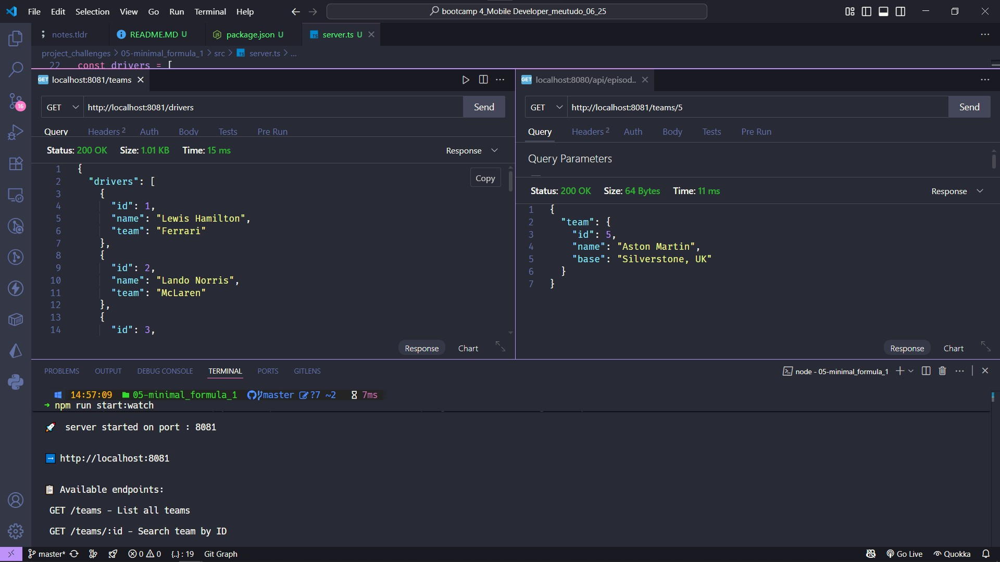

<p align="center">

</p>

# Minimal Fórmula 1

### 🔍 Overview

The **_Minimal Formula 1 API_** is a web application developed with _Node.js_, _TypeScript_ and _Fastify_, designed to provide up-to-date data on Formula 1 teams and drivers. This API offers an intuitive and efficient way to access information about the teams and drivers of the current season, with a <u>lightweight</u> and <u>scalable </u> backend architecture.

Taught by _Felipe Silva Aguiar_ - Tech Educator at DIO.
<br>

> ### 🎯 Objective
>
> The Minimal Formula 1 API was created to practice building a web API using **_[Node.js](https://nodejs.org/)_** and **_[TypeScript](https://www.typescriptlang.org/)_** and **_[Fastify](https://fastify.dev/)_**, focusing on providing up-to-date F1 data. It implements endpoints for listing and searching for teams and drivers, reinforcing concepts such as TypeScript type safety, modular project structure, and RESTful API design. ✅

<br>

### 🧩 Features

- List all teams: Returns all Formula 1 2024 / 25 teams.
- Search for team ID: Returns a specific team by its identifier.
- List all drivers: Returns all drivers in the 2024 / 25 season.
- Search for driver ID: Returns a specific driver by their identifier.
- CORS enabled: API ready for frontend consumption.

---

<p align="center">
      
</p>

---

### 📚 Prerequisites

- [ ] &nbsp;&nbsp;&nbsp;Before starting this project, you should have basic knowledge in the following areas:
      <br>
- Programming Logic: Understanding of basic programming concepts.
- TypeScript: Familiarity with TypeScript syntax and type safety.
- Node.js: Basic understanding of Node.js runtime, HTTP module, and module system.
- NPM and Dependencies: Experience with installing and managing dependencies via NPM.

---

### 🛠️ Technologies Used

- [](https://nodejs.org/)
- [](https://fastify.dev/)
- [](https://www.npmjs.com/package/@types/node)
- [](https://www.typescriptlang.org/)
- [](https://github.com/egoist/tsup)
- [](https://github.com/egoist/tsx)
- [](https://www.thunderclient.com/)
- [](https://code.visualstudio.com/)

---

### 📂 Project Structure

```bash
├── 📁 assets/
│   ├── 🖼️ Model.jpg
│   └── 🖼️ logo_minimal_f1.png
├── 📁 node_modules/ 🚫 (auto-hidden)
├── 📁 src/
│   └── 📄 server.ts
├── 🔒 .env 🚫 (auto-hidden)
├── 🚫 .gitignore
├── 📜 LICENSE
├── 📖 README.MD
├── 📄 package-lock.json
├── 📄 package.json
└── 📄 tsconfig.json
```

---

### 💻 Implementation

#### 📋 List all teams

- **Endpoint:** `GET /teams`.
- **Description:** Returns all Formula 1 2024/25 teams.

```json
{
  "teams": [
    {
      "id": 1,
      "name": "Ferrari",
      "base": "Maranello, Itália"
    },
    {
      "id": 2,
      "name": "McLaren",
      "base": "Woking, UK"
    }
  ]
}
```

#### 🔍 Search for a team by ID

- **Endpoint:** `GET /teams/:id`.
- **Description:** Returns a specific team by ID.
- **Example request:** `GET /teams/1`

#### 📋 Listar todos os pilotos

- **Endpoint:** `GET /drivers`.
- **Description:** Returns all drivers for the 2024 season.

```json
{
  "drivers": [
    {
      "id": 1,
      "name": "Lewis Hamilton",
      "team": "Ferrari"
    },
    {
      "id": 2,
      "name": "Lando Norris",
      "team": "McLaren"
    }
  ]
}
```

#### 🔍 Search for driver by ID

- **Endpoint:** `GET /drivers/:id`.
- **Description:** Returns a specific driver by ID.
- **Example request:** `GET /drivers/18`

---

### ⚙️ Setup and Running

1. Clone the repository:
   ```bash
   git clone <repository-url>
   ```
2. Navigate to the project directory:
   ```bash
   cd minimal-f1-api
   ```
3. Install dependencies:
   ```bash
   npm install
   ```
4. Configure environment variables (optional)::
   ```bash
   # Create a .env file
   PORT=8080
   ```
5. Run in development mode:
   ```bash
   npm run start:dev
   ```
6. Access the endpoints:
   - `GET http://localhost:8080/teams` - List all teams.
   - `GET http://localhost:8080/teams/1` - Search for teams by ID.
   - `GET http://localhost:8080/drivers` - List all drivers.
   - `GET http://localhost:8080/drivers/4` - Search for drivers by ID.

> 📝 Note: Ensure Node.js (version 18.11.0 or higher) is installed. The project uses ES Modules, so the `package.json` includes `"type": "module"`. Configure the `.env` file if additional environment variables are needed.

---

### 🔬 Testing

✔️ - Manual Testing:

- [x] Verify that `GET /teams` returns all teams correctly.
- [x] Test `GET /teams/:id` with valid and invalid IDs.
- [x] Validate `GET /drivers` returns all drivers.
- [x] Test `GET /drivers/:id` with different IDs.
- [x] Check CORS headers and content types.
- [x] Test error responses for resources not found.

---

### 🧠 Skills Learned

✔️ - By completing this project, you will acquire the following skills:

- Building a web API with Node.js, TypeScript, and Fastify.
- Implementing REST endpoints with route parameters.
- Configuring CORS for frontend consumption.
- Structuring a TypeScript project with strict typing.
- Manipulating JSON data and handling HTTP errors.
- Setting environment variables with TypeScript.

---

### 🤝 Contribute

Contributions are welcome! Feel free to open issues or submit pull requests to enhance the project.

### 📜 License

This project is licensed under the [MIT License](LICENSE).

<br>

[⬆ Back to top](#minimal-fórmula-1)
