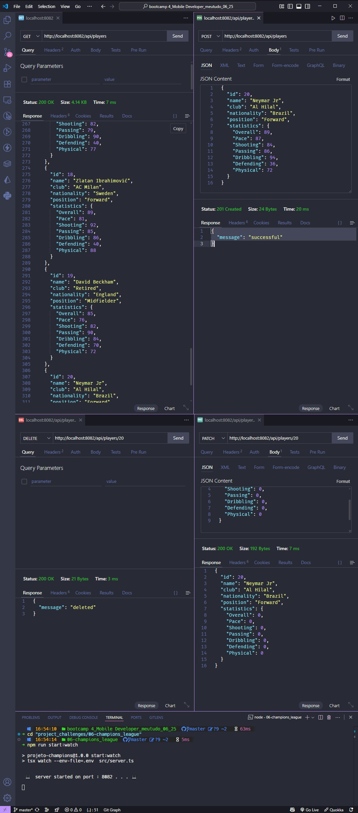
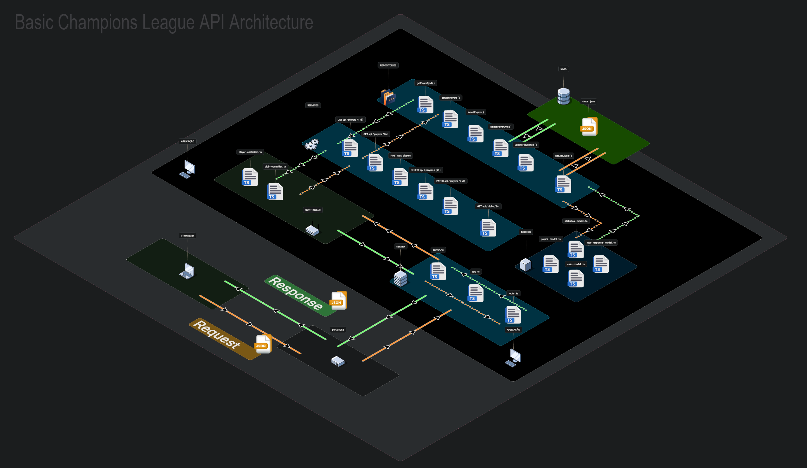

<p align="center">

</p>

# Champions League API

### 🔍 Overview

The **_Champions League API_** is a web application developed with _Node.js_, _TypeScript_ and _Express_, designed to provide data on football players and clubs from the Champions League. This API offers an intuitive way to manage player information with a <u>lightweight</u> and <u>scalable</u> backend architecture.

Taught by _Felipe Silva Aguiar_ - Tech Educator at DIO.
<br>

> ### 🎯 Objective
>
> The Champions League API was created to practice building a web API using **_[Node.js](https://nodejs.org/)_** and **_[TypeScript](https://www.typescriptlang.org/)_** and **_[Express](https://expressjs.com/)_**, focusing on providing up-to-date F1 data. It implements endpoints for listing and searching for teams and drivers, reinforcing concepts such as TypeScript type safety, modular project structure, and RESTful API design. ✅

<br>

### 🧩 Features

- **List all players**: Returns all Champions League players
- **Get player by ID**: Returns a specific player by identifier
- **Create new player**: Adds a new player to the database
- **Update player statistics**: Modifies player attributes and statistics
- **Delete player**: Removes a player from the database
- **List all clubs**: Returns all football clubs
- **CORS enabled**: API ready for frontend consumption

---

<p align="center">
  <a href="./assets/Model.jpg" target="_blank">
    
  </a>  
</p>

---

### 📚 Prerequisites

- [ ] &nbsp;&nbsp;&nbsp;Before starting this project, you should have basic knowledge in the following areas:
      <br>
- Programming Logic: Understanding of basic programming concepts.
- TypeScript: Familiarity with TypeScript syntax and type safety.
- Node.js: Basic understanding of Node.js runtime, HTTP module, and module system.
- REST APIs: Knowledge of HTTP methods and REST principles
- NPM and Dependencies: Experience with installing and managing dependencies via NPM.

---

### 🛠️ Technologies Used

- [](https://nodejs.org/)
- [](https://expressjs.com/)
- [](https://www.typescriptlang.org/)
- [](https://developer.mozilla.org/en-US/docs/Web/HTTP/CORS)
- [](https://github.com/egoist/tsup)
- [](https://www.thunderclient.com/)
- [](https://github.com/egoist/tsx)
- [](https://code.visualstudio.com/)

---

### 📂 Project Structure

```bash
├── 📁 assets/
│   └── 🖼️ logo_champions_league.png
├── 📁 node_modules/ 🚫 (auto-hidden)
├── 📁 src/
│   ├── 📁 controllers/
│   │   ├── 📄 clubs-controller.ts
│   │   └── 📄 players-controller.ts
│   ├── 📁 data/
│   │   └── 📄 clubs.json
│   ├── 📁 models/
│   │   ├── 📄 club-model.ts
│   │   ├── 📄 http-response-model.ts
│   │   ├── 📄 player-model.ts
│   │   └── 📄 statistics-model.ts
│   ├── 📁 repositories/
│   │   ├── 📄 clubs-repository.ts
│   │   └── 📄 players-repository.ts
│   ├── 📁 services/
│   │   ├── 📄 clubs-service.ts
│   │   └── 📄 players-service.ts
│   ├── 📁 utils/
│   │   └── 📄 http-helper.ts
│   ├── 📄 app.ts
│   ├── 📄 routes.ts
│   └── 📄 server.ts
├── 🔒 .env 🚫 (auto-hidden)
├── 🚫 .gitignore
├── 📜 LICENSE
├── 📖 README.MD
├── 📄 arch-editavel.tldr
├── 📄 package-lock.json
├── 📄 package.json
└── 📄 tsconfig.json

```

---

### 💻 Implementation

<p align="center">
  <a href="./assets/basic_champions_league_architecture-2.png" target="_blank">
    
  </a>
</p>

#### 💻 API Endpoints

<br>

##### 📋 Players Management

| Method   | Endpoint           | Description              |
| -------- | ------------------ | ------------------------ |
| `GET`    | `/api/players`     | Get all players          |
| `GET`    | `/api/players/:id` | Get player by ID         |
| `POST`   | `/api/players`     | Create new player        |
| `PATCH`  | `/api/players/:id` | Update player statistics |
| `DELETE` | `/api/players/:id` | Delete player            |

<br>

##### 🏟️ Clubs Management

| Method | Endpoint     | Description   |
| ------ | ------------ | ------------- |
| `GET`  | `/api/clubs` | Get all clubs |

<br>

##### 📝 Example Player Object

```json
{
  "id": 1,
  "name": "Lionel Messi",
  "club": "Paris Saint-Germain",
  "nationality": "Argentina",
  "position": "Forward",
  "statistics": {
    "Overall": 93,
    "Pace": 85,
    "Shooting": 94,
    "Passing": 91,
    "Dribbling": 95,
    "Defending": 38,
    "Physical": 65
  }
}
```

---

### ⚙️ Setup and Running

1. Clone the repository:
   ```bash
   git clone <repository-url>
   ```
2. Navigate to the project directory:
   ```bash
   cd champions_league
   ```
3. Install dependencies:
   ```bash
   npm install
   ```
4. Configure environment variables (optional)::
   ```bash
   # Create a .env file
   PORT=8082
   ```
5. Run in development mode:
   ```bash
   npm run start:dev
   ```
6. Access the API:
   ```text
   hhttp://localhost:8082
   ```
7. Test endpoints:
   - `GET http://localhost:8082/api/players`
   - `GET http://localhost:8082/api/clubs`

> 📝 Note: Ensure Node.js (version 18.11.0 or higher) is installed. The project uses ES Modules, so the `package.json` includes `"type": "module"`. Configure the `.env` file if additional environment variables are needed.

---

### 🔬 Testing

✔️ - Manual Testing:

- [x] Verify all player CRUD operations work correctly.
- [x] Test club listing functionality.
- [x] Validate error handling for invalid requests.
- [x] Check CORS headers and response formats.
- [x] Test edge cases (non-existent players, empty requests).

---

### 🧠 Skills Learned

✔️ - By completing this project, you will acquire the following skills:

- Building RESTful APIs with Express and TypeScript.
- Implementing CRUD operations with proper error handling.
- Creating modular architecture with separation of concerns.
- Configuring CORS for cross-origin requests.
- Developing with TypeScript interfaces and type safety.
- Building scalable backend applications.

---

### 🤝 Contribute

Contributions are welcome! Feel free to open issues or submit pull requests to enhance the project.

### 📜 License

This project is licensed under the [MIT License](LICENSE).

<br>

[⬆ Back to top](#champions-league-api)
