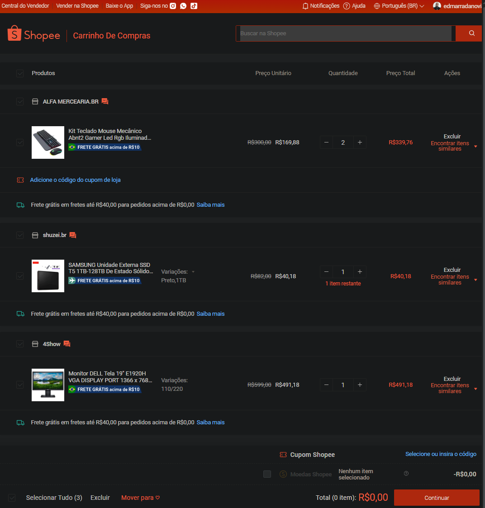

# Shopee Shopping Cart - Backend Learning Project

## Overview

A simple backend application developed to consolidate Node.js and JavaScript concepts.

Taught by _Felipe Silva Aguiar_ - Tech Educator at DIO.
<br>

> 🎯 Objective:
>
> - This project, was created to practice backend development skills using **_[Node.js](https://nodejs.org)_** and pure **_[JavaScript](https://developer.mozilla.org/en-US/docs/Web/JavaScript)_**. It implements a shopping cart system with basic CRUD operations (add, remove, delete, display, and calculate total), reinforcing concepts like asynchronous programming, modularization, and data manipulation. ✅

<br>

### 🚀 Features

- Add items to the cart
- Remove items (decrease quantity or remove completely)
- Delete items by name
- Display cart contents with formatted prices
- Calculate product subtotals and cart totals

---

<table align="center"
  <tr>
    <td align="center">
      
    </td>
  </tr>
</table>

---

### 🛠️ Technologies Used

The project was fully completed and some of the resources used were:

[](https://developer.mozilla.org/en-US/docs/Web/JavaScript)

[](https://nodejs.org/)

[](https://code.visualstudio.com/)

---

#### 📂 Project Structure

```bash
project_challenges/shopee_shopping_cart/
├── assets
├── src/
      ├── services/
      │      ├── cart.js      # Cart management functions
      │      ├── item.js      # Item creation with subtotal
      │
      └── index.js            # Main script to run the application
```

---

#### ⚙️ Setup and Running

- [ ] &nbsp;&nbsp;&nbsp;Prerequisites:
      ✔️ - Node.js (version 18.11.0 or higher for --watch support).<br>
- [ ] If you choose, clone the repository:

```bash
git clone https://github.com/ed-radanovis/Bootcamp-Mobile-Developer_Project-Challenges_06-2025/tree/master/project_challenges/shopee_shopping_cart
```

<br>

- [x] Navigate to the project: `cd project_challenges/shopee_shopping_cart`.
      <br>
- [x] Run the Application:

```bash
node --watch src/index.js
```

---

#### 🔬 Testing

✔️ - Manual Testing:

- [x] &nbsp;&nbsp;&nbsp;Verify item addition, removal, and deletion.
- [x] &nbsp;&nbsp;&nbsp;Check if subtotals and total are calculated correctly with R$ formatting.
- [x] &nbsp;&nbsp;&nbsp;Test edge cases (e.g., removing items not in the cart).

---

<br>

[⬆ Back to top](#shopee-shopping-cart---backend-learning-project)
